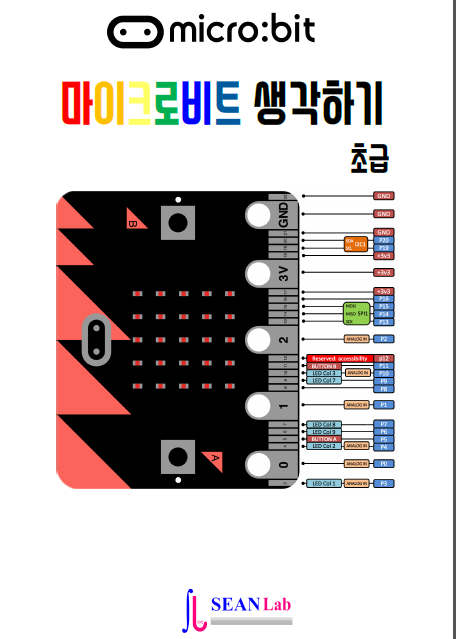

.. sphinxtemp2 documentation master file, created by
   sphinx-quickstart on Sat Nov 10 18:39:39 2018.
   You can adapt this file completely to your liking, but it should at least
   contain the root `toctree` directive.

Mighty Microbit Basic
=======================================

 Mighty Microbit Basic Lessons for Beginner

      written by sean base on following books

.. image:: ./img/chapter0_4.png

.. toctree::
   :maxdepth: 4

   ./lessons/beautiful-image
   ./lessons/lucky-7
   ./lessons/answering-machine
   ./lessons/game-of-chance
   ./lessons/smiley
   ./lessons/magic-logo
   ./lessons/snowflake-fall
   ./lessons/screen-wipe
   ./lessons/flashing-heart
   ./lessons/blink
   ./lessons/night-light
   ./lessons/game-counter
   ./lessons/happy-birthday

